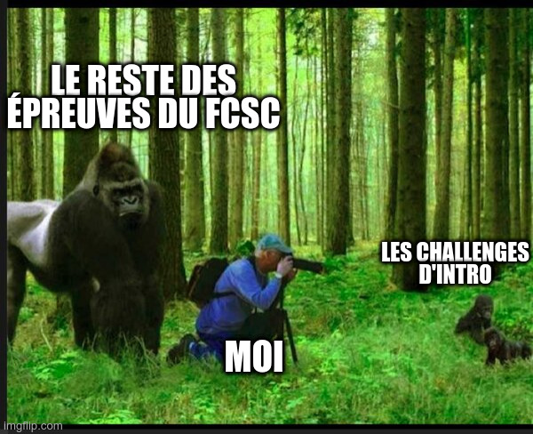

# FCSC 2022 Gare au Gorille

J’ai construit un site sans prétention pour stocker ma collection de memes !

Auteur : [Cryptanalyse](https://x.com/Cryptanalyse)

Origine : [Gare au Gorille](https://hackropole.fr/fr/challenges/web/fcsc2022-web-gare-au-gorille/)

-----------

## Connectez vous
> http://localhost

-----------

## Installation manuel
Vous n'utilisez pas l'application **les CTFs de Cyrhades** ? C'est dommage !
Mais voici comment installer ce CTF manuellement :

> git clone https://github.com/Hack-Oeil/fcsc2022-web-gare-au-gorille.git

> cd fcsc2022-web-gare-au-gorille

-----------

## Sur le site officiel hackropole.fr
> https://hackropole.fr/fr/challenges/web/fcsc2022-web-gare-au-gorille/